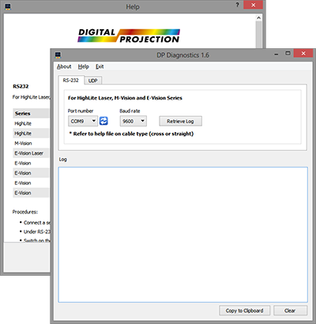

### DP-Diagnostics

A unified diagnostics utility for DP projectors.

#### RS232
---
__For HighLite Laser, M-Vision and E-Vision Series.__

| Series		 | Model				 | Baud rate | Cable Type		 |
| ---------------|-----------------------|-----------|------------------ |
| HighLite		 | Laser 11K, 13K		 | 9600		 | Straight			 |
| HighLite		 | Cine 335 3D			 | 9600		 | Straight			 |
| M-Vision		 | Cine 230, 260, 400 3D | 9600		 | Straight			 |
| E-Vision Laser | 8500					 | 9600		 | Straight			 |
| E-Vision   	 | 8000					 | 38400	 | Straight	 		 |
| E-Vision   	 | 7500					 | 115200	 | Straight	 		 |
| E-Vision   	 | 7000					 | 115200	 | Cross (Null Modem)|
| E-Vision  	 | 6800					 | 9600		 | Cross (Null Modem)|

__Procedures__
- Connect a serial cable from your computer to the projector. 
- Under RS-232 tab, select the correct COM port, baud-rate then click "Retrieve Log" button.
- Switch on the projector and wait for log download process to start.
- Click "Copy to Clipboard" button to copy the log. 
- Describe your problem in email and attach the log to our support email address.

#### UDP 
---
__For Titan Quad Series and HighLite 8000, 740 & 660 (Lamp Based).__

__Procedures__
- Disconnect projector from main power before you proceed.
- Connect a LAN cable from your computer to the projector "Update" port.
- On UDP tab, click on "Retrieve Log" button and apply power to projector.
- Switch on projector and wait for log download process to start.
- Click "Copy to Clipboard" button to copy the log.
- Describe your problem in email and attach the log to our support email address.